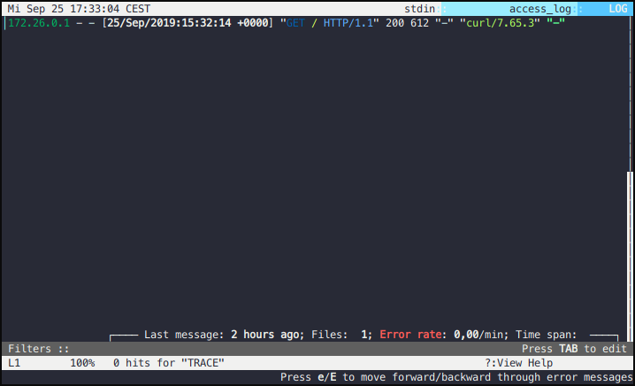

# dclnav

ZSH plugin to open [docker-compose](https://github.com/docker/compose) logs in [lnav](http://lnav.org/).
Plugin itself simply calls `docker-compose logs [service...]`, strips the container name prefix, removes any shell coloring and then pipes the output to lnav.

## Example

```
docker-compose up -d
curl localhost:8080
dclnav nginx
docker-compose stop
```


